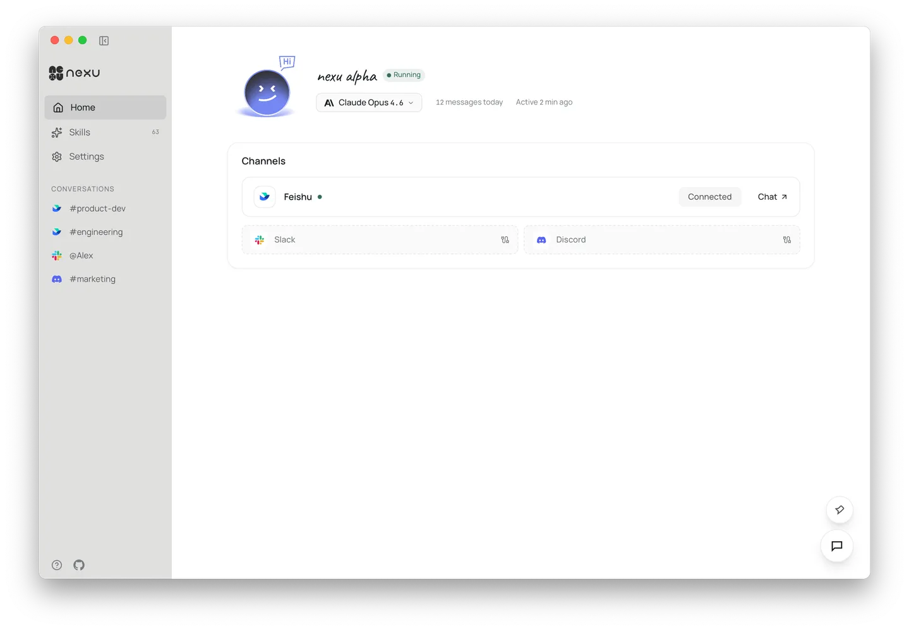

# nene

`nene` is an open-source desktop client for local-first AI agents.

It connects OpenClaw agents to Feishu, Slack, Discord, and other chat channels from one desktop app, with graphical setup, built-in skills, multi-model support, and BYOK.



## What is in this repository

- `apps/desktop` — Electron shell and host bridge
- `apps/controller` — local controller, runtime coordination, and persistence
- `apps/web` — desktop-local UI
- `packages/shared` — shared schemas and contracts

## Quick start

```bash
pnpm install
pnpm typecheck
pnpm build
pnpm test
pnpm generate-types
```

## Project notes

- Public branding in this repository is `nene`
- Phase 1 intentionally keeps upstream-compatible internal names such as `@nexu/*`, `NEXU_*`, and `~/.nexu` to reduce sync and migration risk
- This repository is independent and is not published as a GitHub fork of the upstream project

## Learn more

- [Official website](https://nene.im)
- [Architecture](ARCHITECTURE.md)
- [Contributing](CONTRIBUTING.md)
- [Upstream sync workflow](docs/upstream-sync.md)
- [English docs landing page](docs/en/index.md)
